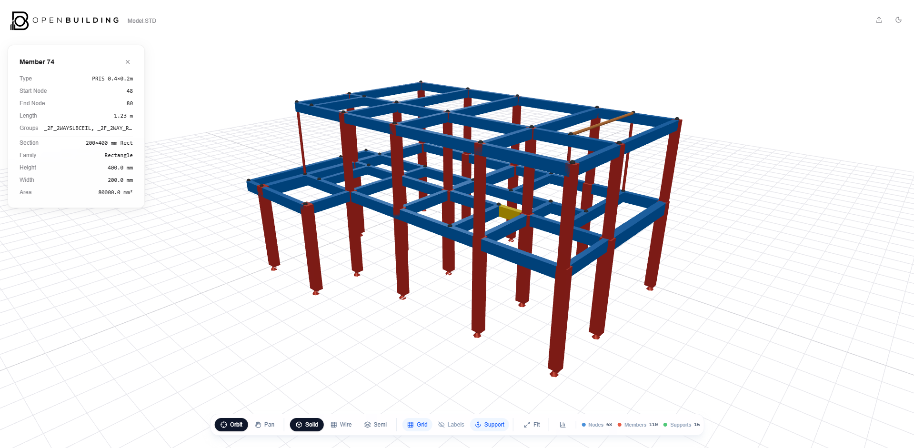
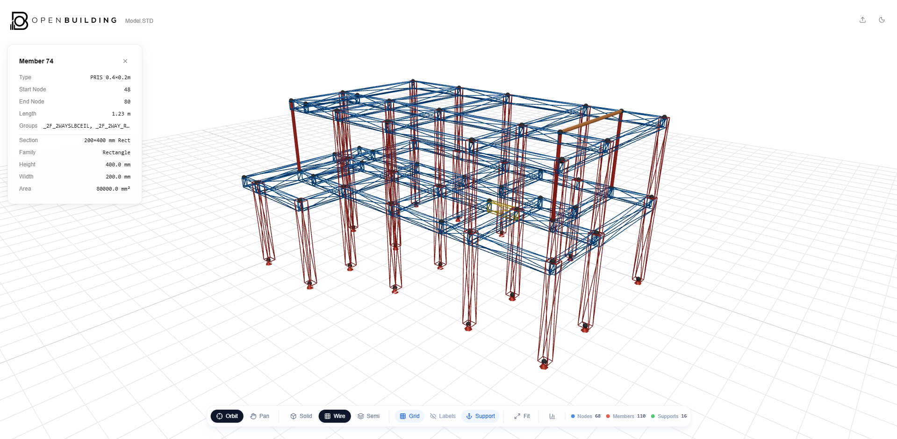
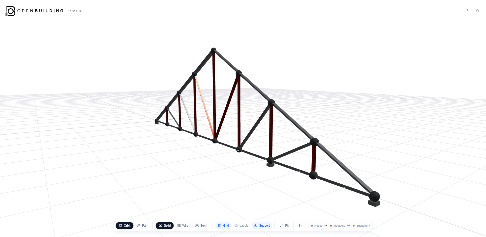
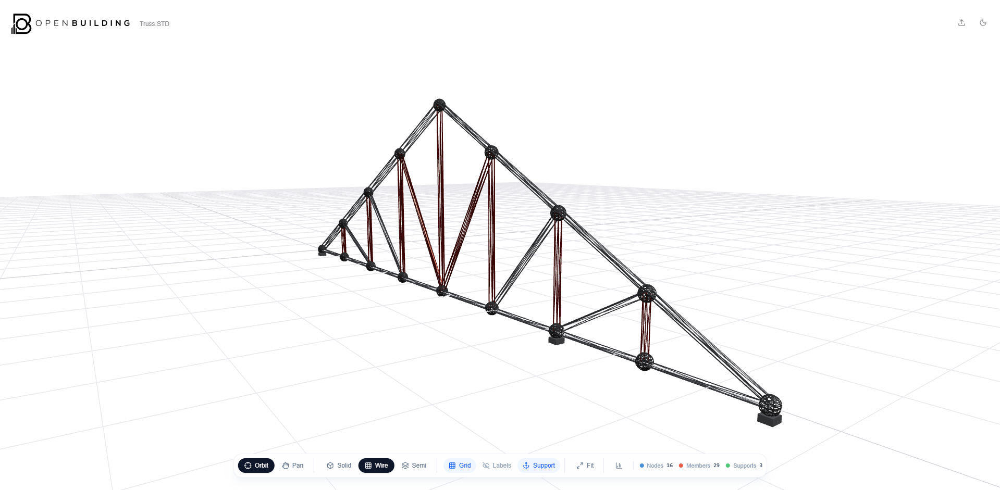

<div align="center">


### Free, open-source 3D structural model viewer. Built for engineers, by engineers.

[](LICENSE)
[](https://www.typescriptlang.org/)
[](https://react.dev/)
[](https://threejs.org/)
[](https://vite.dev/)

[Live Demo](https://openbuilding.vercel.app/) · [Report Bug](https://github.com/your-org/openbuilding/issues) · [Request Feature](https://github.com/your-org/openbuilding/issues)

</div>

---

## What is this?

Most structural analysis software (STAAD.Pro, ETABS, SAP2000, ROBOT) locks you into their own viewer. You can't share a model with a client who doesn't have a license. You can't open a colleague's file from a different software. You can't view anything without booting the full application.

**OpenBuilding fixes that.** Drop in a structural model file, and it renders instantly in your browser. No install, no license, no account. The goal is to support every major analysis format so that viewing a structural model is as easy as opening a PDF.

Right now it supports **STAAD.Pro (.std)**. More formats are being added. If you want to add one, the architecture makes it straightforward (see [Adding a New Format](#-adding-a-new-format)).

---

## Preview

> _Screenshots below are from a sample RC frame and steel truss model._

<table>
  <tr>
    <td align="center">
      
      <br /><strong>Solid View</strong>
    </td>
    <td align="center">
      
      <br /><strong>Wireframe View</strong>
    </td>
  </tr>
  <tr>
    <td align="center">
      
      <br /><strong>Solid View</strong>
    </td>
    <td align="center">
      
      <br /><strong>Wireframe View</strong>
    </td>
  </tr>
</table>

---

## Features

- **Instant 3D rendering**: Wide flanges, channels, angles, HSS, pipes, and plates rendered with accurate cross-section polygons, not generic cylinders
- **AISC steel library**: 1,223 sections from the AISC v16 database, looked up automatically from your model's TABLE references
- **Section properties**: Area, Ix, Iy displayed in the info panel for both steel and prismatic sections
- **Click to inspect**: Select any member or plate to see its section, dimensions, start/end nodes, and group assignments
- **View modes**: Solid, Wireframe, and X-Ray (semi-transparent)
- **Nav modes**: Orbit or Pan, useful for Mac and trackpad users who don't have a right-click
- **Responsive**: Desktop has a full floating toolbar. Mobile has a fixed scrollable bottom bar (think TradingView)
- **Dark mode**
- **No server, no account**: Fully client-side. Files are never uploaded anywhere.

---

## Supported Formats

| Format | Extension | Status |
|--------|-----------|--------|
| STAAD.Pro | `.std` | ✅ Supported |
| ETABS | `.$et` / `.e2k` | 🔜 Planned |
| SAP2000 | `.s2k` | 🔜 Planned |
| ROBOT Structural | `.str` | 🔜 Planned |

---

## Getting Started

### Requirements

- Node.js 18+
- A browser that supports WebGL (every modern browser does)

### Run locally

```bash
git clone https://github.com/your-org/openbuilding.git
cd openbuilding
npm install
npm run dev
```

Open [http://localhost:5173](http://localhost:5173) and drop in a `.std` file.

### Build for production

```bash
npm run build
```

Output goes to `dist/`. It's a static site. Deploy it anywhere (Vercel, Netlify, Cloudflare Pages, S3, etc.).

---

## Project Structure

```
src/
├── parser/              # Format parsers, one folder per software
│   ├── types.ts         # Core contracts: SectionProfile, SectionMeta, ParseSection
│   └── staad/           # STAAD.Pro parser
│       ├── index.ts
│       ├── steel-resolver.ts   # Maps STAAD TABLE names → AISC canonical keys
│       └── commands/           # JOINT COORDINATES, MEMBER INCIDENCES, etc.
│
├── lib/
│   ├── steel-db.ts      # AISC registry: 1,223 sections, built from JSON at startup
│   ├── geometry-utils.ts  # buildExtrudedProfile(), the one renderer function
│   ├── section-profiles.ts  # Shoelace formula → area, Ix, Iy
│   └── colors.ts
│
├── store/               # Zustand stores: model, view toggles, UI selection state
├── components/
│   ├── viewer/          # R3F scene: members, nodes, plates, supports, camera
│   ├── toolbar/         # BottomToolbar: unified desktop + mobile toolbar
│   ├── panels/          # InfoPanel: member/plate detail
│   └── layout/          # TopBar, MainLayout
│
└── data/
    └── aisc-sections.json   # Pre-converted AISC database (regenerate with scripts/convert-aisc.mjs)
```

---

## 🔌 Adding a New Format

The parser pipeline is designed to make this as painless as possible. Here's the short version:

1. **Create a folder** `src/parser/yourformat/`
2. **Write a parser** that reads the file and outputs `BaseParseResult` (a list of nodes, members, plates, and supports)
3. **For each member**, build a `SectionProfile` (a polygon) and `SectionMeta` (label, family, dims)
4. **Register the format** in `src/parser/index.ts`

That's it. The 3D renderer, info panel, and toolbar don't need to know your format exists.

For steel sections, you can reuse `lookupSteelSection(key)` from `lib/steel-db.ts`. It returns a ready-made polygon and metadata for any AISC section. For custom or proprietary sections, just build the polygon yourself.

See `src/parser/staad/` for a complete working example. The steel resolver pattern there (`staad/steel-resolver.ts`) is worth copying for any format that references sections by name.

---

## Architecture Notes

A few decisions that are worth knowing before you dig in:

**Every section is a polygon.** There's no `if (type === 'W_FLANGE') { ... }` dispatch in the renderer. The parser produces a `SectionProfile` (an array of `[x, z]` points) and the renderer just extrudes it. This means adding a new section shape only touches the parser, nothing else.

**Section types are a single source of truth.** The `SectionType` union in `parser/types.ts` is the canonical list. `SteelSectionVariant` is derived from it via `Extract<SectionType, 'STEEL_${string}'>`, so you never have to update both.

**The AISC database is static JSON.** `src/data/aisc-sections.json` is generated from the official AISC v16 CSV via `scripts/convert-aisc.mjs`. If you need to update it or add sections, edit the script and re-run it. The app loads the JSON at startup into a `Map` for O(1) lookups.

**No backend.** The app is 100% static. File parsing happens in the browser. Nothing is sent to a server.

---

## Tech Stack

| | |
|---|---|
| Framework | React 19 + TypeScript 6 |
| Build | Vite 8 |
| 3D | Three.js 0.185 via @react-three/fiber + @react-three/drei |
| State | Zustand 5 |
| Styling | Tailwind CSS v4 |
| Animation | Framer Motion |
| Icons | Lucide React |

---

## Contributing

Pull requests are welcome. For significant changes, open an issue first to discuss what you'd like to do.

If you're adding a new format parser, the most useful thing you can do is include a sample file in `sample-files/` so others can test it.

If you find a section that renders wrong or a model that doesn't parse correctly, opening an issue with the problematic file (or a minimal reproduction) is extremely helpful.

---

## License

MIT. Do whatever you want with it. See [LICENSE](LICENSE).

